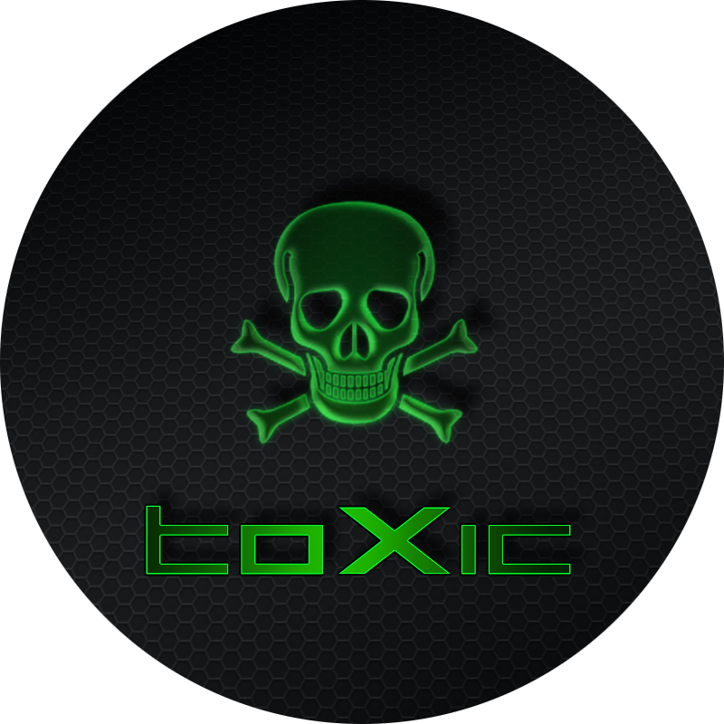
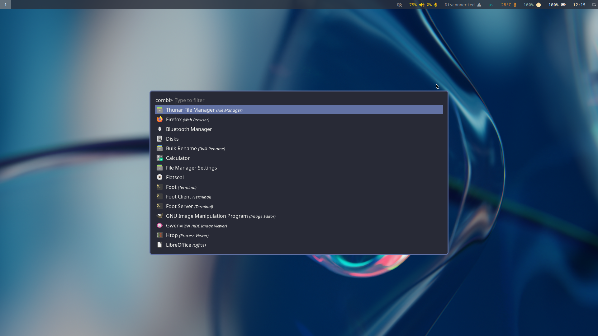
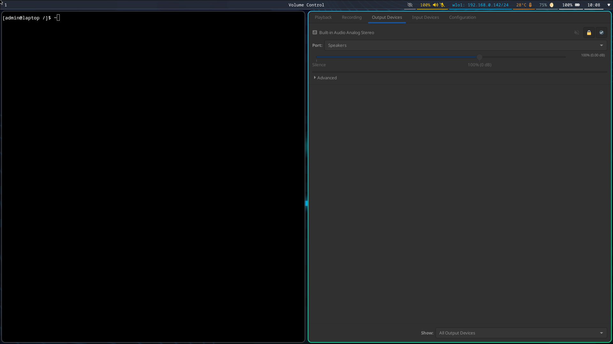

# Toxicblue



[](https://app.codacy.com/gh/toxicwebdev/toxicblue/dashboard?utm_source=gh&utm_medium=referral&utm_content=&utm_campaign=Badge_grade)
[](https://github.com/toxicwebdev/toxicblue/actions/workflows/build.yml)
[](https://github.com/toxicwebdev/toxicblue/actions/workflows/build-dx.yml)
[](https://github.com/toxicwebdev/toxicblue/actions/workflows/trivy.yml)

## Overview

toxicblue is a project that leverages the [BlueBuild](https://blue-build.org/) template to create minimally-opinionated [Fedora Atomic](https://fedoraproject.org/atomic-desktops/) operating system images for various Wayland compositors. The project aims to provide ready-to-use images with sane defaults for the following compositors:

- Hyprland (with waybar)
- Qtile (experimental)
- River (with waybar)
- Sway (with waybar)
- Wayfire (with wf-shell)

## DX Images

A developer workstation that provides a container-focused experience.

## Features

- Saner SDDM defaults
- Optimized waybar defaults
- Comprehensive toolkit for a functional Wayland compositor desktop
- Pre-configured, minimally opinionated setups for each supported compositor

## Purpose

While the Fedora Atomic ecosystem offers excellent base images and tools for immutable image building, it lacks readily available images for most Wayland compositors (except Sway). toxicblue fills this gap by providing images with sensible defaults for a variety of Wayland compositors.

## Customization

For custom modifications, it's recommended to create a new repo using the [BlueBuild template](https://github.com/blue-build/template) rather than forking this project. Set your `base-image` to a toxicblue image to apply your customizations efficiently without constant upstream synchronization.

## Installation

### Available Images

| Name         | Compositor | Nvidia Support  |
|--------------|------------|-----------------|
| `hyprland`   | Hyprland   | No              |
| `hyprland-dx`| Hyprland   | No              |
| `qtile`      | Qtile      | No              |
| `qtile-dx`   | Qtile      | No              |
| `river`      | River      | No              |
| `river-dx`   | River      | No              |
| `sway`       | Sway       | No              |
| `sway-dx`    | Sway       | No              |
| `wayfire`    | Wayfire    | No              |
| `wayfire-dx` | Wayfire    | No              |

### Rebasing Process

To rebase an existing Silverblue/Kinoite/Sericea installation to the latest toxicblue build:

> [!IMPORTANT]
> Only the `latest` tag is supported.

> [!NOTE]
> Two reboots are required. The first boot into toxicblue provisions the necessary SDDM user, a one-time step.

1. Rebase to the unsigned image:

    ```bash
    rpm-ostree rebase ostree-unverified-registry:ghcr.io/toxicwebdev/$IMAGE_NAME:latest
    ```

2. Reboot:

    ```bash
    systemctl reboot
    ```

3. Rebase to the signed image:

    ```bash
    rpm-ostree rebase ostree-image-signed:docker://ghcr.io/toxicwebdev/$IMAGE_NAME:latest
    ```

4. Final reboot:

    ```bash
    systemctl reboot
    ```

## Screenshots





## ISO Creation

For Fedora Atomic builds, you can generate an offline ISO following the instructions [here](https://blue-build.org/learn/universal-blue/#fresh-install-from-an-iso). Note that free distribution on GitHub is not possible due to size limitations.

## Verification

Images are signed using [Sigstore](https://www.sigstore.dev/)'s [cosign](https://github.com/sigstore/cosign). Verify signatures by downloading the `cosign.pub` file and running:

```bash
cosign verify --key cosign.pub ghcr.io/toxicwebdev/$IMAGE_NAME:latest
```

## Contributing

Please refer to the [contributing documentation](CONTRIBUTING.md#contributing) and adhere to the [Code of Conduct](CODE_OF_CONDUCT.md).

For more information on BlueBuild, visit the [BlueBuild homepage](https://blue-build.org/).
